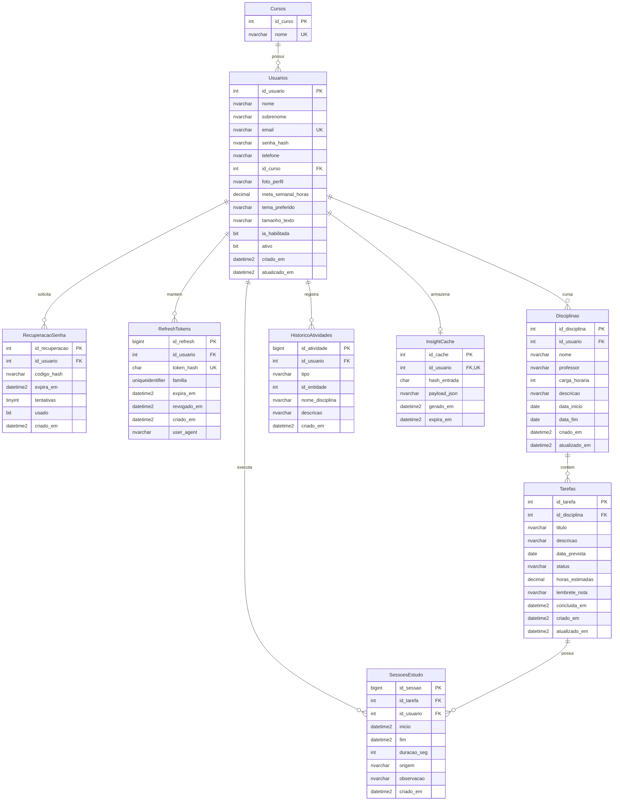

# Diagrama Entidade-Relacionamento (DER) - EduTrack AI v2

Abaixo está o modelo de dados relacional completo em sintaxe Mermaid, demonstrando todas as tabelas, cardinalidades e restrições.

```mermaid
erDiagram
    Cursos ||--o{ Usuarios : "possui"
    Usuarios ||--o{ RecuperacaoSenha : "solicita"
    Usuarios ||--o{ RefreshTokens : "mantem"
    Usuarios ||--o{ Disciplinas : "cursa"
    Usuarios ||--o{ SessoesEstudo : "executa"
    Usuarios ||--o{ HistoricoAtividades : "registra"
    Usuarios ||--o| InsightCache : "armazena"
    Disciplinas ||--o{ Tarefas : "contem"
    Tarefas ||--o{ SessoesEstudo : "possui"

    Cursos {
        int id_curso PK
        nvarchar nome UK
    }

    Usuarios {
        int id_usuario PK
        nvarchar nome
        nvarchar sobrenome
        nvarchar email UK
        nvarchar senha_hash
        nvarchar telefone
        int id_curso FK
        nvarchar foto_perfil
        decimal meta_semanal_horas
        nvarchar tema_preferido
        nvarchar tamanho_texto
        bit ia_habilitada
        bit ativo
        datetime2 criado_em
        datetime2 atualizado_em
    }

    RecuperacaoSenha {
        int id_recuperacao PK
        int id_usuario FK
        nvarchar codigo_hash
        datetime2 expira_em
        tinyint tentativas
        bit usado
        datetime2 criado_em
    }

    RefreshTokens {
        bigint id_refresh PK
        int id_usuario FK
        char token_hash UK
        uniqueidentifier familia
        datetime2 expira_em
        datetime2 revogado_em
        datetime2 criado_em
        nvarchar user_agent
    }

    Disciplinas {
        int id_disciplina PK
        int id_usuario FK
        nvarchar nome
        nvarchar professor
        int carga_horaria
        nvarchar descricao
        date data_inicio
        date data_fim
        datetime2 criado_em
        datetime2 atualizado_em
    }

    Tarefas {
        int id_tarefa PK
        int id_disciplina FK
        nvarchar titulo
        nvarchar descricao
        date data_prevista
        nvarchar status
        decimal horas_estimadas
        nvarchar lembrete_nota
        datetime2 concluida_em
        datetime2 criado_em
        datetime2 atualizado_em
    }

    SessoesEstudo {
        bigint id_sessao PK
        int id_tarefa FK
        int id_usuario FK
        datetime2 inicio
        datetime2 fim
        int duracao_seg
        nvarchar origem
        nvarchar observacao
        datetime2 criado_em
    }

    HistoricoAtividades {
        bigint id_atividade PK
        int id_usuario FK
        nvarchar tipo
        int id_entidade
        nvarchar nome_disciplina
        nvarchar descricao
        datetime2 criado_em
    }

    InsightCache {
        int id_cache PK
        int id_usuario FK,UK
        char hash_entrada
        nvarchar payload_json
        datetime2 gerado_em
        datetime2 expira_em
    }
```
